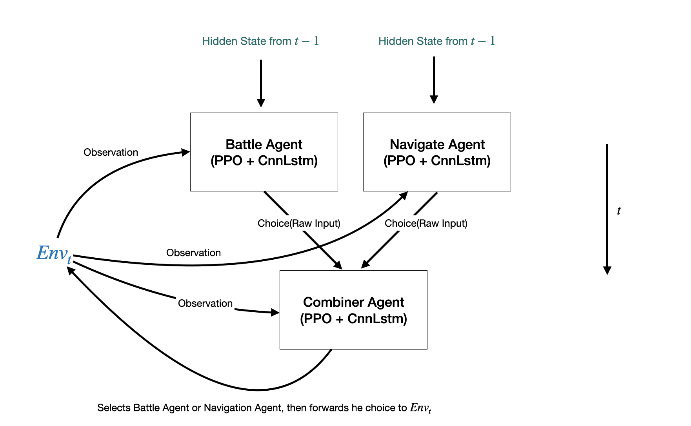
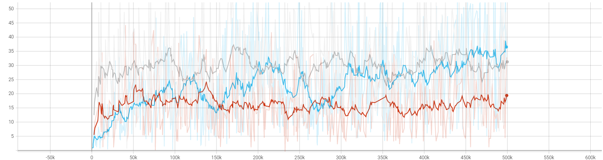

# ano-doom-agent

A Doom game playing Deep Reinforcement Learning agent. Combines battle agent and navigator agent using a combining agent all implemented using PPO with CnnLstm Policy.

## Model Framework

Tested on Defend The Center Map with kill count and survival time as reward metrics.

## Battle Agent

## Navigator Agent

## Combined Agent

## Training Results

Grey is final result, Blue is naive agent, Red is combined agent with entropy reward (entropy reward didn't work as expected).
